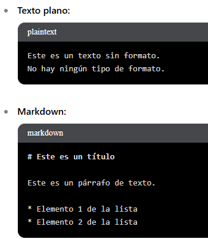

# 🌐 Todo sobre MARKDOWN

## Que es Markdown?

> Markdown es un **lenguaje de marcado** con el que **puedes agregar formato a documentos de texto plano.**
> 
> - El **marcado es como dar instrucciones a un programa para que muestre el texto de una manera específica**.
> - Un t**exto plano es un texto sin ningun formato**, es decir sin estilos, colores , ni fuentes especiales, solo contiene caracteres simples y basicos , como un block de notas por ejemplo.
> 
> 
> 
> Diferencias texto sin formato y Markdown
> 

## Porque usar Markdown?

### **Conversion a HTML**

> El código Markdown se puede convertir fácilmente a HTML, que es el lenguaje utilizado para crear páginas web.
Existen herramientas y plataformas que pueden tomar el texto en Markdown y transformarlo en HTML
> 

### Simplificacion

> **Markdown es una version simplificada de HTML**. Está diseñado para ser más fácil de leer y escribir que el HTML, sin necesidad de usar etiquetas complejas.
> 

### Compatibilidad

> Puedes utilizar HTML dentro de los documentos de Markdown si necesitas un control más preciso sobre el formato. Esto proporciona flexibilidad adicional cuando Markdown por sí solo no es suficiente
> 

## Usos de Markdown

> Hoy en dia se usa en muchos lugares, estos solo son algunos de sus usos
> 

### **Escritura y Documentación:**

- **Plataformas de blogging:** WordPress, Medium, Ghost, etc.
- **Herramientas de gestión de contenido:** Notion, Obsidian, etc.
- **Editores de texto:** Atom, Visual Studio Code, Sublime Text, etc.
- **Redes sociales:** Reddit, Discord, etc.
- **Lectura y edición de archivos:** GitHub, GitLab, etc.
- **Documentación de software:** README.md archivos, documentación interna, etc.

### **Comunicación:**

- **Correos electrónicos:** Algunos clientes de correo electrónico permiten escribir en Markdown para dar formato a los mensajes.
- **Mensajes instantáneos:** Slack, Telegram, etc.

### **Otras aplicaciones:**

- **Formatos de archivo:** Se puede usar Markdown para crear archivos de texto plano con formato, como archivos README o archivos de configuración.

## Sintaxis

> **Documento Markdown**
Los documentos se crean con extensión **`.md`**.
> 

### Encabezado

> Similar a HTML, existen 6 niveles de títulos (**`#`**, **`##`**, **`###`**, **`####`**, **`#####`** y **`######`**)
> 

```html
# This is a Heading h1
## This is a Heading h2
### This is a Heading h3
#### This is a Heading h4
##### This is a Heading h5
###### This is a Heading h6
```

<aside>
💡

Algunas aplicaciones tienen configuraciones predeterminadas para agregar lineas horizontales luego de un encabezado h1,h2 sin necesidad de indicarlo

</aside>


### **Énfasis (Negritas y Cursivas):**

> Todos los textos escritos en markdown se traducen a párrafos de texto, es decir a elementos **`<p>`** de HTML. Además, los textos escritos pueden estar rodeados de ciertos carácteres para darles formato
> 

```html
*cursiva*	
**negrita**	
***negrita cursiva***	
```


### Listas

- **Listas sin orden o desordenada**
    
    > Utilizar los guiones **`-`** al principio de una linea.
    > 
    
    ```html
    - Primer elemento de una lista
    - Segundo elemento de una lista
      - Subelemento uno
      - Subelemento dos
    ```
    
    
    
- **Listas ordenadas**
    
    > Escribiremos un número seguido de un punto
    > 
    
    ```html
    1. Primer elemento de una lista
    2. Segundo elemento de una lista
    3. Tercer elemento de una lista
    ```
    

### Enlaces

> Añadimos el texto a enlazar entre corchetes **`[]`**, seguido de la URL a enlazar entre paréntesis **`()`**.
> 

```html
[texto del enlace](URL)	

La web de [ManzDev](https://manz.dev/)
```

<aside>
💡

Ten en cuenta que puedes incluir una imagen dentro del **`[]`** del enlace , creando así una imagen con enlace a una web o recurso.

</aside>

### Imagenes

```html
	


```

### Codigo en Linea

> Usamos c**omillas simples invertidas** alrededor del texto para **codigo dentro de una linea de texto, para pequeñas piezas de codigo**
> 

```html
`código`
Podemos utilizar los backticks para indicar código en línea: `console.log("Hola!")`. 
```

### **Bloques de Codigo**

> Para multiples lineas de codigo o bloques de código más largos, **se utilizan tres comillas invertidas simples ( `) al principio y al final del bloque**
> 
> 
> <aside>
> 💡
> 
> Esto **crea un bloque de código separado del texto que lo rodea**. **Opcionalmente**, **se puede especificar el lenguaje de programación** para que el procesador Markdown pueda aplicar resaltado de sintaxis:
> 
> </aside>
> 

```html
  """Esto es un bloque de codigo"""
```


Ejemplo de un bloque de codigo

### **Citas**

> Usamos el **signo mayor antes del texto**
> 

```html
> Cita
```

- **Citas anidadas**
    
    > Podemos utilizar una cita dentro de otra, y crear citas o menciones anidadas
    > 
    
    ```html
    > Esto es una cita simple.
    >> Esto es una cita anidada.
    ```
    


Ejemplo de cita y cita anidada

### Linea Horizontal

> Si queremos añadir una línea horizontal a modo de separación temática, **simplemente debemos escribir tres guiones seguidos**: **`---`**
> 

```html
Texto
---
parrafo
```


### **Tablas**

> **Columnas**
Se usan **caracteres de pipe (`|`) para separar las columnas**
> 
- **Estructura**
    1. **Encabezados** 
        
        > Los encabezados van el primera fila
        > 
        
        ```html
        | Encabezado 1 | Encabezado 2 | Encabezado 3 |
        ```
        
    2. **Separadores de Encabezados**
        
        > **La segunda fila de la tabla contiene guiones (- - -) para cada columna,** separados por barras verticales **`|`**
        > 
        
        ```html
        | Encabezado 1 | Encabezado 2 | Encabezado 3 |
        |--------------|--------------|--------------|
        ```
        
    3. **Filas de datos**
        
        > Las siguientes filas contienes los datos de la tablas , **cada celda esta separada por barras verticales**
        > 
        
        ```html
        | Nombre       | Edad | Ciudad   |
        |--------------|-----:|:--------:|
        | Juan         |   25 | Lima     |
        | María        |   30 | Cusco    |
        | Carlos       |   28 | Arequipa |
        ```
        
